---
html:
  embed_local_images: true
---

# GDPR-Compliant File System (GDPRFS)

A FUSE-based file system that enforces GDPR compliance at the filesystem level. Every file operation (read, write, rename, delete) is intercepted and checked against consent policies, PII ownership rules, and GDPR article requirements, all in real time.

**GDPR articles implemented:** 5 (Accuracy), 6 (Lawful Basis), 9 (Special Categories), 15 (Right of Access), 16 (Right to Rectification), 17 (Right to Erasure), 30 (Records of Processing Activities).

**Three measurement modes:** baseline (plain FS, no GDPR), `gdpr_no_llm` (GDPR without LLM), `gdpr_with_llm` (GDPR with LLM content analysis).

---

## Table of Contents

1. [Architecture](#1-architecture)
2. [Project Structure](#2-project-structure)
3. [Setup & Prerequisites](#3-setup--prerequisites)
4. [Commands for Executing GDPRFS](#4-commands-for-executing-gdprfs)
5. [Database Schema](#5-database-schema)
6. [Core Concepts](#6-core-concepts)
7. [GDPR Article Implementation Map](#7-gdpr-article-implementation-map)
8. [Data Subjects & Internal Users](#8-data-subjects--internal-users)
9. [Benchmarks](#9-benchmarks)

---

## 1. Architecture

### Components

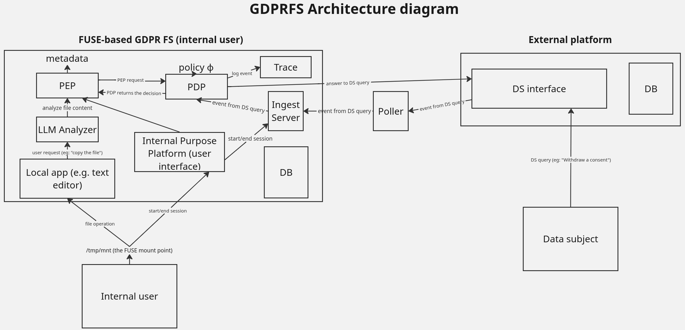

| Component | Port | Role |
|-----------|------|------|
| **FUSE Daemon** (`gdprfs/myfs.py`) | 7000 (ingest) | Core filesystem + GDPR enforcement. Intercepts all file ops, checks consent, emits events to EnfGuard enforcer. |
| **External Consent Platform** (`external_consent_platform/`) | 5000 | Web portal for Data Subjects (DS). Manages consent, Art 15/16/17 requests. |
| **Internal Purpose Platform** (`internal_purpose_platform/`) | 8000 | Web portal for internal users. Manages sessions (purpose/reason), merge alerts, `.gdprowner` declarations. |
| **LLM Analyzer** (`LLManalyzer/`) | 5005 | GPT API (gpt-5-nano) wrapper. Scans file contents for PII and Art 9 special data categories. |


### Communication Flow

```
Data Subject (browser)                    Internal User (browser)
        |                                          |
        v                                          v
External Consent Platform (:5000)    Internal Purpose Platform (:8000)
        |                                          |
        |  Poller (every 6s)                       |  Direct HTTP POST
        |  GET /api/events?status=pending          |
        v                                          v
        +----------> FUSE Ingest Server (:7000) <--+
                            |
                     logger.log([Event])
                            |
                     EnfGuard (MFOTL policy engine)
                            |
                     suppress / allow / cause
                            |
                     FUSE operation result
                     (content or REDACTED)
```

### Communication Matrix
| From | To | Port | Endpoint | Implemented in (= where the server route is defined) | Purpose |
|------|----|------|----------|----------------|---------|
| Poller | DS Interface | 5000 | `GET /api/events?status=pending` | `external_consent_platform/api.py` | Fetch all pending consent events |
| Poller | DS Interface | 5000 | `PATCH /api/events/{id}/ack` | `external_consent_platform/api.py` | Acknowledge processed event |
| Poller | Ingest Server | 7000 | `POST /ingest` | `gdprfs/myfs.py` | Forward consent and request events |
| Internal Purpose Platform | Ingest Server | 7000 | `POST /ingest` | `gdprfs/myfs.py` | StartSession and StopSession |
| DS Interface | Ingest Server | 7000 | `POST /sync_users` | `gdprfs/myfs.py` | Notify new DS registration |
| DS Interface | Ingest Server | 7000 | `POST /upload_rectification` | `gdprfs/myfs.py` | Art 16 file staging |
| DS Interface | Ingest Server | 7000 | `GET /access_status/{uid}` | `gdprfs/myfs.py` | Art 15 status check |
| DS Interface | Ingest Server | 7000 | `GET /access_download/{id}` | `gdprfs/myfs.py` | Art 15 ZIP download |
| PDP | DS Interface | 5000 | `GET /api/consents/{uid}/{purpose}` | `external_consent_platform/api.py` | Check regular consent (Art 6) |
| PDP | DS Interface | 5000 | `GET /api/consents/special/{uid}/{spCat}` | `external_consent_platform/api.py` | Check special data categories consent (Art 9) |
| PDP | DS Interface | 5000 | `GET /api/users` | `external_consent_platform/api.py` | Sync registered users |

---

## 2. Project Structure

```
instrlib/
├── gdprfs/                              # FUSE file system daemon
│   ├── myfs.py                          # Main FUSE daemon: all FS ops, consent checks,
│   │                                    #   PDF/CSV/TXT enforcement, ingest HTTP server, causation handlers
│   ├── models.py                        # SQLAlchemy ORM: File, Person, PersonFileSpecialCategory,
│   │                                    #   ProcessingRecord, NameAlias, person_file_map
│   ├── db_utils.py                      # PII detection (4-tier), .gdprowner parsing, user sync,
│   │                                    #   text extraction (PDF/CSV/TXT)
│   ├── llm.py                           # LLM API integration, merge alert generation, Art 9 categories
│   ├── settings.py                      # Paths: EnfGuard binary, MFOTL formula, signature, trace log
│   ├── setup_db.py                      # Initialize gdprfs.db (create all tables)
│   ├── merge_alerts.py                  # Persist merge alerts JSON for internal platform UI
│   ├── policies/                        # MFOTL enforcement policies
│   │   ├── gdprfs.mfotl                 # Main GDPR policy formula
│   │   ├── gdprfs.sig                   # Event signature file
│   │   ├── gdprfs.rex and gdprfs.lex    # for enforcement
│   │   └── session.mfotl, consent.mfotl, delete.mfotl  # Sub-policies
│   └── README.md                        # This file
│
├── external_consent_platform/           # Data Subject (DS) web portal
│   ├── app.py                           # Flask app: signup, login, consent and revoke forms,
│   │                                    #   Art 15 download, Art 16 upload, Art 17 withdraw all consents then erase
│   ├── api.py                           # REST API: /api/events, /api/consents/{uid}/{purpose},
│   │                                    #   /api/consents/special/{uid}/{spCat}, /api/users
│   ├── models.py                        # User, Event, CurrentEventState
│   ├── poller.py                        # Background daemon: polls pending events → POST to FUSE /ingest
│   ├── event_config.yaml                # Event type definitions + state_change mappings
│   ├── templates/                       # index.html (DS portal), my_data.html (Art 15), signup, login
│   └── instance/external_consent_platform.db
│
├── internal_purpose_platform/           # Internal user web portal
│   ├── app.py                           # Flask app: session (start and stop), merge alert resolution,
│   │                                    #   POST StartSession and StopSession to FUSE /ingest
│   ├── models.py                        # InternalUser, CurrentSession
│   ├── purposes_and_reasons.yaml        # Purpose hierarchy (marketing/service/analytics → reasons)
│   ├── templates/                       # index.html (session mgmt + merge alerts), signup, login
│   └── instance/internal_purpose_platform.db
│
├── LLManalyzer/                         # LLM-based file content analyzer
│   ├── api.py                           # Flask API (:5005): POST /analyze-file, POST /enable, /disable
│   ├── agent.py                         # Pydantic-AI agent (with GPT): PII detection, Art 9 categories
│   ├── models.py                        # Pydantic models: PersonHit, ChunkAnalysis, SpecialDataCategory
│   └── splitter.py                      # Multi-format file splitting: txt, pdf, csv
│
├── instrlib/                            # Generic runtime enforcement library
│   ├── instrument.py                    # Operation interception (decorators)
│   ├── enforcer.py                      # EnfGuard process wrapper
│   ├── pdp.py                           # Policy Decision Point (queries MFOTL)
│   ├── pep.py                           # Policy Enforcement Point (applies decisions)
│   ├── event.py                         # Event model for policy evaluation
│   ├── logger.py                        # Event logging and audit trail
│   ├── handler_graph.py                 # Handler execution graph
│   ├── schema.py                        # Event schema definition
│   └── django/                          # Django integration modules
│
├── benchmark/                           # Time measurement benchmarks per GDPR article
│   ├── art5&6_perf_test.py              # Art 5+6: lawfulness of processing
│   ├── art9_perf_test.py                # Art 9: special categories (baseline + gdpr_with_llm only)
│   ├── art15_perf_test.py               # Art 15: right of access (2 workflows)
│   ├── art16_perf_test.py               # Art 16: right to rectification (2 workflows)
│   ├── art17_perf_test.py               # Art 17: right to erasure
│   ├── art30_perf_test.py               # Art 30: records of processing (baseline + gdpr_with_llm only)
│   └── results/                         # CSV data + PNG charts
│
├── setup_fuse_env.sh                    # Install system deps, Python packages, create /var/lib/gdprfs
├── run_all.sh                           # Launch all 4 components in parallel terminals
├── reset_myfs_sudo.sh                   # Kill FUSE daemon, unmount /tmp/mnt, recreate mount point
├── .env                                 # OpenAI API key for LLM Analyzer
└── gdprfs.db                            # Main GDPRFS SQLite database
```

---

## 3. Setup & Prerequisites

### System Dependencies
- Linux with FUSE support (`/dev/fuse`)
- Python 3.x
- `poppler-utils` (provides `pdftotext` for PDF processing)

### First-Time Setup
```bash
# Change directory to the root of the project
cd ~/MA3/Building_a_GDPR-compliant_file_system/instrlib

# Install all system deps + Python packages + create /var/lib/gdprfs structure
./setup_fuse_env.sh
```

This script:
- Installs `poppler-utils`, configures `/dev/fuse` permissions
- Creates symlinks for `fuse.py` and `fuseparts`
- Installs Python packages: SQLAlchemy, Flask, Requests, Pydantic, Pydantic-AI, OpenAI, python-docx, odfpy, pandas, openpyxl, pdfminer.six
- Generates `/var/lib/gdprfs/redacted_template.pdf`
- Creates `/var/lib/gdprfs/.gdprowner` (root-only)

### LLM Analyzer Setup
Set the API key in `.env`:
```
OPENAI_API_KEY=sk-...
```

### Initialize GDPRFS Database
```bash
sudo python3 gdprfs/setup_db.py
```
To reset (delete and recreate):
```bash
sudo rm gdprfs.db
sudo python3 gdprfs/setup_db.py
```

---

## 4. Commands for Executing GDPRFS

### How to Run
```bash
cd ~/MA3/Building_a_GDPR-compliant_file_system/instrlib # the root of the project
./setup_fuse_env.sh
./reset_myfs_sudo.sh
./run_all.sh
```
Then in a separate terminal:
```bash
sudo -E PYTHONPATH=. /home/ann20010929/gdprfs-venv/bin/python3 gdprfs/myfs.py /tmp/mnt -f -o allow_other
```

### How to Stop
- **External/Internal platforms & LLM Analyzer:** `Ctrl+C` in their terminals
- **FUSE daemon:** run `./reset_myfs_sudo.sh` from the instrlib directory

### How to Reset Databases (if needed)
```bash
# Reset GDPRFS DB
sudo rm gdprfs.db && sudo python3 gdprfs/setup_db.py

# Reset External Consent Platform DB
sudo rm external_consent_platform/instance/external_consent_platform.db
# (recreated automatically on next app.py startup)

# Reset Internal Purpose Platform DB
sudo rm internal_purpose_platform/instance/internal_purpose_platform.db
# (recreated automatically on next app.py startup)
```

### Ports Summary

| Service | Port |
|---------|------|
| External Consent Platform | 5000 |
| Internal Purpose Platform | 8000 |
| LLM Analyzer | 5005 |
| FUSE Ingest Server | 7000 |

---

## 5. Database Schema

### GDPRFS Database (`gdprfs.db`)

| Table | Columns | Purpose |
|-------|---------|---------|
| `file` | id, file_id (unique), abs_path, created_at, modified_at, accessed_at, sha256, special_categories, last_action | File metadata + Art 9 categories |
| `person` | id, uid (unique, nullable), first_name, last_name, registered (bool) | Data subjects. `registered=True` = signed up on external platform. `uid=NULL` = detected by LLM but unregistered. |
| `person_file_map` | person_id, file_id | Many-to-many: which persons are linked to which files |
| `person_file_special_category` | id, person_id, file_id, special_category | Per-person-per-file Art 9 categories (e.g., Alice has "health" data in report.pdf) |
| `processing_record` | id, processor, controller, activity, property, value, timestamp | Art 30 records of processing activities (audit trail) |
| `alias_person_map` | id, alias (unique), person_id | Human-confirmed name aliases (e.g., "Hsieeh" → "Hsieh") |

### External Consent Platform DB (`external_consent_platform.db`)

| Table | Columns | Purpose |
|-------|---------|---------|
| `users` | id, uid, first_name, last_name, password_hash | Registered data subjects |
| `events` | event_id, kind, uid, purpose, spCat, fid, fid_new, status, created_at | Event log (Consent, Revoke, RequestAccess, etc.). `status`: pending → acked |
| `current_event_state` | current_state_id, uid, purpose, category, spCat, status, updated_at | Current consent state per DS per purpose |

### Internal Purpose Platform DB (`internal_purpose_platform.db`)

| Table | Columns | Purpose |
|-------|---------|---------|
| `internal_users` | id, uid, first_name, last_name, password_hash | Internal system users |
| `current_sessions` | current_state_id, uid, purpose, reason, started_at, active | Active processing session per internal user |

---

## 6. Core Concepts

### 6.1 Two-Layer File Architecture

| Layer | Path | Access | Purpose |
|-------|------|--------|---------|
| **Upper** | `/var/lib/gdprfs/upper/` | User-writable | Working copy. All FUSE ops happen here. |
| **Mirror** | `/var/lib/gdprfs/mirror/` | Root-only, immutable | Trusted audit copy. Synced on every write/rename. |

The FUSE daemon mounts at `/tmp/mnt` and maps all operations to the upper layer. The mirror layer is maintained automatically as a tamper-proof backup.

`/tmp/mnt` is the "normal" file system of the internal user (what the internal user sees in Nautilus or file manager).


### 6.2 PII Detection Hierarchy (4 Tiers)

PII ownership is determined in strict priority order: **stops at first match**:

| Priority | Tier | Source | Example |
|----------|------|--------|---------|
| 1 | **`.gdprowner`** | Internal user declares ownership rules | `jdoe: jdoe/**` → all files under `jdoe/` belong to jdoe |
| 2 | **Folder name** | Folder name matches a known Person | Folder `fhublet/` → matched to François Hublet (fhublet) |
| 3 | **Filename** | Filename contains a Person's name | File `jdoe_report.txt` → matched to John Doe |
| 4 | **Content** (fallback) | File content scanned for names | Text contains "John Doe" → linked to jdoe |

- `.gdprowner` is located at `/var/lib/gdprfs/.gdprowner`, one rule per line (e.g. `jdoe: jdoe/**`).
- Folder name activates automatically when a folder name matches a known data subject.

**Key function:** `update_file_mapping_for_upper()` in `db_utils.py`

### 6.3 Consent Model

**Regular consent (Art 6):** per data subject, per purpose (marketing, service, analytics).

**Special consent (Art 9):** per data subject, per special data category (health, genetic, religious, racial_ethnic, political, trade_union, biometric, sex_life).

### 6.4 Enforcement by Format

| Format | Granularity | Redaction |
|--------|-------------|-----------|
| **PDF** | Per page | Entire page replaced by blank "REDACTED" page |
| **CSV** | Per row | Row cells replaced by `"REDACTED"` |
| **TXT** | Full file | Entire content replaced by `b"REDACTED"` |

---

## 7. GDPR Article Implementation Map

| Article | Right / Requirement | Implementation |
|---------|---------------------|----------------|
| **Art 5** | Principles of processing | Purpose limitation via sessions; accuracy detection |
| **Art 6** | Lawful basis (consent) | Pre-check consent before every read and write; suppress if revoked |
| **Art 9** | Special categories | Special category tracking; separate consent checks |
| **Art 15** | Right of access | DS requests access → FUSE packages all their files + manifest into ZIP  |
| **Art 16** | Right to rectification | DS uploads corrected file → FUSE replaces original  |
| **Art 17** | Right to erasure | DS withdraws all consent + requests erasure → FUSE deletes file from upper + mirror + DB |
| **Art 30** | Records of processing | Every enforcement action logged to `ProcessingRecord` table with timestamp |

---

## 8. Data Subjects & Internal Users

### Data Subjects (External Consent Platform)

| uid | first_name | last_name | pwd |
|-----|------------|-----------|-----|
| fhublet | François | Hublet | fh |
| whsieh | Wei-En | Hsieh | weh |
| jdoe | John | Doe | jd |
| dbasin | David | Basin | db |
| zkowalski | Zara | Kowalski | zk |

### Internal Users (Internal Purpose Platform)

| uid | first_name | last_name | pwd |
|-----|------------|-----------|-----|
| achao | An-Chu | Chao | acc |

---

## 9. Benchmarks

All benchmarks are in the `benchmark/` directory. Each measures the time used across 3 modes (unless noted).

### Prerequisites
Start all services first (see [How to Run](#how-to-run)).

### Commands

| Article | Modes | Command |
|---------|-------|---------|
| **5 & 6** | all 3 | `python3 -m benchmark.art5\&6_perf_test --mode all --n 1` |
| **9** | baseline + with_llm (requires LLM) | `python3 -m benchmark.art9_perf_test --mode baseline --n 1` then `--mode gdpr_with_llm` |
| **15** | baseline + no_llm (no LLM needed) | `python3 -m benchmark.art15_perf_test --workflow all --mode all --n 1` |
| **16** | all 3, per workflow | `python3 -m benchmark.art16_perf_test --workflow wf1 --mode baseline --n 1` (repeat for each mode and wf2) |
| **17** | baseline + no_llm (no LLM needed) | `python3 -m benchmark.art17_perf_test --mode all --n 1` |
| **30** | baseline + with_llm (requires LLM) | `python3 -m benchmark.art30_perf_test --mode all --n 1` |

Note: 
- For article 15 and article 17, no LLM is required, because we test each article independently.
- For article 9 and article 30, LLM is required, because we must analyze the file contents to detect if they belong to any special data categories.

### Enforcer vs LLM Overhead Analysis

The three measurement modes isolate where the performance cost lies:

| Mode | Enforcer | LLM | Purpose |
|------|----------|-----|---------|
| `baseline` | No | No | Pure filesystem cost |
| `gdpr_no_llm` | Yes | No | Enforcer-only overhead |
| `gdpr_with_llm` | Yes | Yes | Full system with LLM content analysis |

Comparing across modes shows that the **MFOTL enforcer (EnfGuard) adds negligible overhead**: the **LLM (GPT API) dominates execution time**:

| Benchmark | baseline | gdpr_no_llm | gdpr_with_llm | Enforcer overhead | LLM overhead |
|-----------|----------|-------------|---------------|-------------------|--------------|
| Art 5&6 | 0.009s | 1.53s | 145.57s | **1.52s** | **144.04s** |
| Art 16 wf1 | 0.0002s | 0.76s | 15.00s | **0.76s** | **14.24s** |
| Art 16 wf2 | 0.0001s | 0.52s | 0.54s | **0.52s** | **0.02s** |

Art 16 wf2 confirms this: it has no write step, so no LLM call is triggered: `gdpr_no_llm` and `gdpr_with_llm` are nearly identical.

#### Overhead decomposition

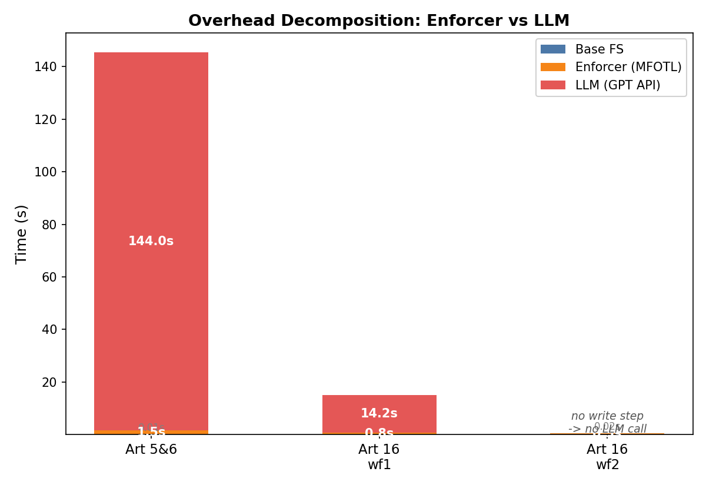

#### Per-step analysis (log scale)

Log scale reveals baseline and enforcer times that are invisible on linear charts.

| Art 5&6 | Art 16 wf1 |
|---------|------------|
| 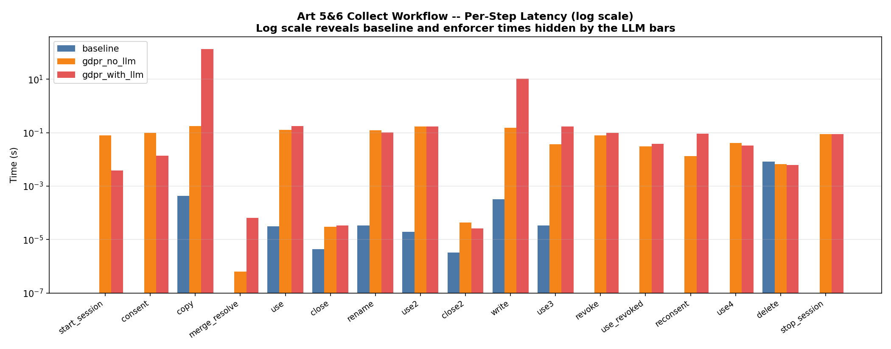 | 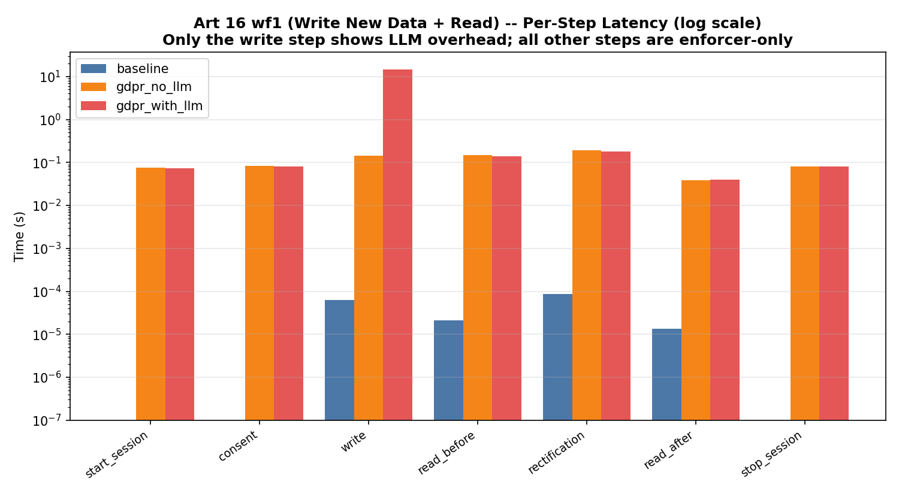 |

**write steps** (which trigger LLM content analysis via `POST /analyze-file`) show significant overhead in `gdpr_with_llm` mode. Reads, consent events, and session operations remain fast across all modes.

#### Art 16: wf1 vs wf2 side-by-side

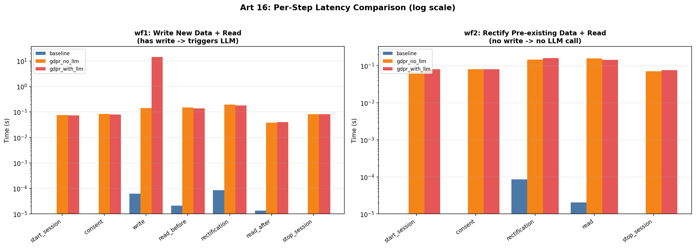

- wf1 includes a write step → triggers LLM → 14s overhead. 
- wf2 has no write step → no LLM call → enforcer-only overhead (~0.5s).


### Time Measurement Results

#### Art 5 & 6
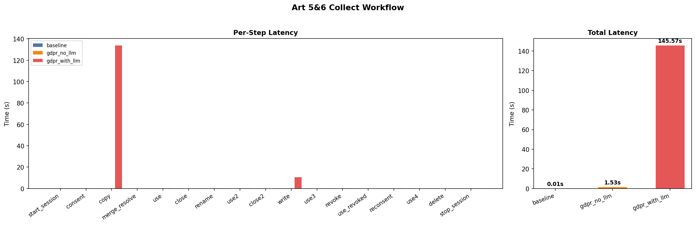

#### Art 9
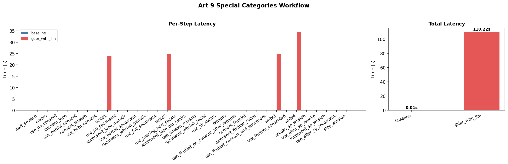

#### Art 15 Workflow 1
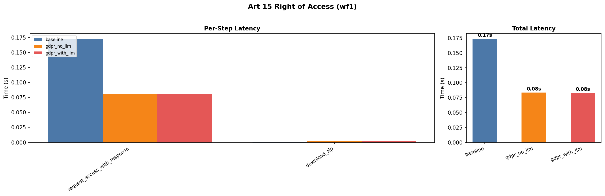

#### Art 15 Workflow 2
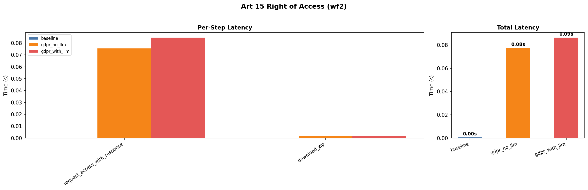

#### Art 16 Workflow 1
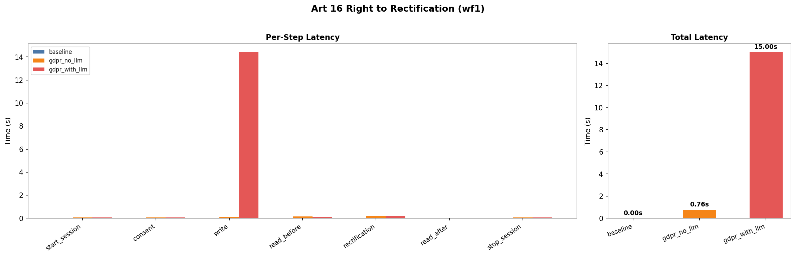

#### Art 16 Workflow 2
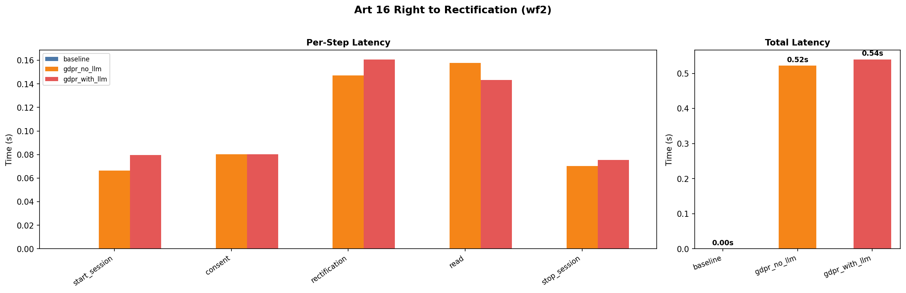


#### Art 17
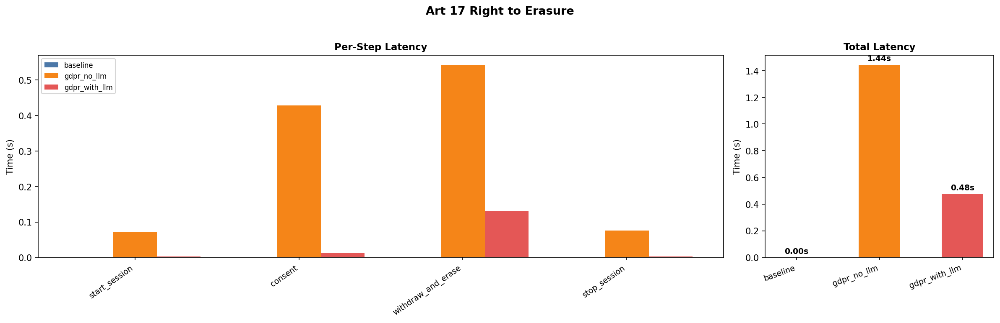

#### Art 30
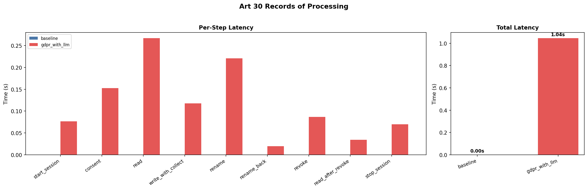
